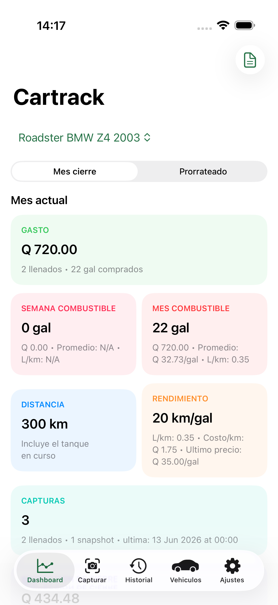
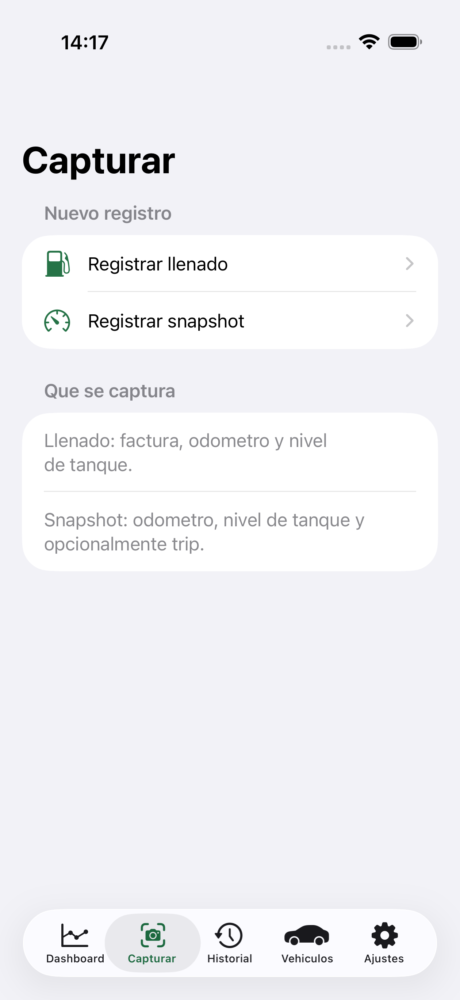
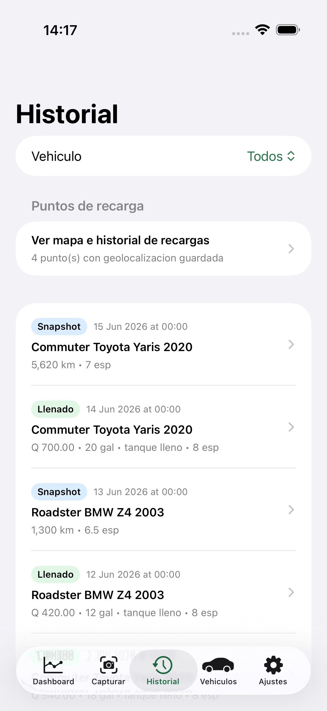
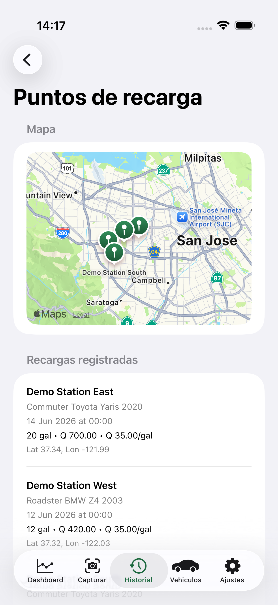
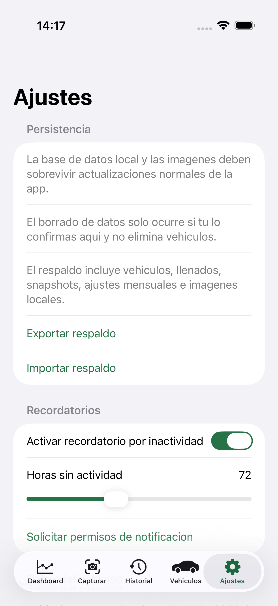

# Car Fuel Notebook

Car Fuel Notebook is a local-first iPhone app for recording refuels, odometer readings, fuel-level snapshots, and the cost of running a vehicle over time.

It is designed around a real-world workflow: after a fuel stop, the user should only need to upload photos of the receipt, odometer, and optionally the tank gauge, review the OCR suggestions, and save the event. The app then keeps the full history locally and calculates weekly, monthly, and per-tank analytics.

## Cartrack v2

The approved v2 source of truth is the Spec Kit package under [`specs/001-cartrack-v2`](specs/001-cartrack-v2/spec.md). Start with:

- [Product specification](specs/001-cartrack-v2/spec.md)
- [Technical plan](specs/001-cartrack-v2/plan.md)
- [Commit-by-commit todo list](specs/001-cartrack-v2/tasks.md)
- [Acceptance matrix](specs/001-cartrack-v2/acceptance-matrix.md)
- [Project constitution](.specify/memory/constitution.md)

V2 remains offline and local-first. Images stay on the device; v2.1 is prepared to synchronize only minimal structured data through a separate cloud project.

## Why This App Exists

Many fuel trackers capture only totals. This app keeps the evidence behind each entry:

- Receipt photo for gallons, total paid, and price per gallon.
- Odometer photo for mileage validation.
- Fuel-level photo for post-refuel and between-refuel snapshots.
- Geolocation for remembering where refuels happened.

That lets the app answer practical questions such as:

- How many gallons did I buy this week and this month?
- How much did I spend in total?
- What price was fuel each time I refueled?
- How many kilometers per gallon is the car delivering?
- How many liters per kilometer is the car consuming?
- Where do I usually refuel?

## Key Features

- Local-first SwiftUI iPhone app with SwiftData persistence.
- Multi-vehicle support.
- Fill-up workflow with receipt, odometer, and fuel-level evidence.
- Snapshot workflow for odometer and fuel-level updates between fill-ups.
- On-device OCR using Apple Vision.
- Manual review and correction before saving.
- Weekly and monthly fuel metrics on the dashboard.
- Refuel map and timeline history.
- Local CSV and PDF report export.
- Local backup export and import, including stored images.
- Reminder support for recurring captures.

## How It Works

### 1. Add a vehicle

Create a vehicle with its name, make, model, year, odometer unit, tank capacity, and reference fuel economy.

This configuration controls how the app interprets readings and how it calculates dashboard metrics.

### 2. Save a full fill-up

Use the **Fill-up** flow when you have a receipt.

1. Add the receipt image.
2. Add the odometer image.
3. Optionally add the fuel-level image.
4. Review OCR suggestions.
5. Correct anything ambiguous.
6. Save the event.

When a full fill-up is saved, the app stores:

- Refuel date.
- Odometer reading.
- Gallons purchased.
- Price per gallon.
- Total paid.
- Tank status.
- Optional geolocation.
- The linked evidence photos.

### 3. Save a snapshot between fill-ups

Use the **Snapshot** flow when you want to track mileage or tank level without a receipt.

1. Add the odometer image.
2. Optionally add the tank-gauge image.
3. Review OCR output.
4. Save after manual confirmation.

This is especially useful for building a better weekly and monthly history without forcing a full refuel event.

### 4. Review weekly and monthly analytics

The dashboard summarizes:

- Weekly gallons purchased.
- Monthly gallons purchased.
- Total spend.
- Price trends per fill-up.
- Kilometers per gallon.
- Liters per kilometer.
- Tank-cycle comparisons.
- Current tank estimate based on the last full fill and latest snapshot.

### 5. Review where the car was refueled

The history tab keeps both the chronological log and the refuel map.

The map uses the saved event coordinates so the user can quickly identify recurring stations and refuel patterns.

### 6. Move data to another device

The app does not depend on cloud sync today.

Instead, it supports a local backup package export and import flow:

1. Export a backup from **Settings**.
2. Share the generated `.cartrackbackup.json` file.
3. Import that backup on another device.

The backup includes structured records and stored evidence images. PDF export is available for reporting, not for round-trip data import.

## Screenshots

### Dashboard overview



### Capture home



### History log



### Refuel map



### Backup and import



## OCR Expectations

OCR is helpful, but it is intentionally not trusted blindly.

- Receipts with clean printed text should prefill gallons, price per gallon, and total.
- Digital odometer clusters may prefill successfully when the image is sharp enough.
- Analog fuel gauges should remain review-first and often require manual confirmation.
- Ambiguous cluster photos should fall back to manual correction instead of inventing values.

That behavior is covered both by parser tests and by local example-image tests using private, ignored fixtures on the developer machine.

## Privacy And Security

This repository is intentionally safe to publish:

- No backend.
- No analytics SDK.
- No cloud credentials.
- No API keys.
- No committed private databases.
- No committed private evidence photos.
- No committed personal route exports.

Public seed data and README screenshots use sanitized demo content only.

Repository publishing and local privacy expectations are documented in [SECURITY.md](SECURITY.md).

## Repository Layout

- `Cartrack/` contains the SwiftUI app, capture flows, dashboard, history, settings, reporting, backup, and services.
- `CartrackCore/` contains shared models, analytics, unit conversion, OCR parsing, and domain rules.
- `CartrackCore/Tests/` contains domain-level tests.
- `CartrackTests/` contains iOS integration tests and private local-image validation.
- `CartrackUITests/` contains functional UI coverage for the simulator.
- `Scripts/` contains local verification, simulator selection, and publish preflight helpers.
- `docs/` contains ADRs, design notes, release notes, and testing documentation.

## Requirements

- macOS with Xcode installed.
- iOS Simulator support.
- Swift 6 compatible toolchain.

`Scripts/select_ios_simulator.sh` prefers an `iPhone Air` simulator when available.

## Local Verification

Run core coverage:

```bash
Scripts/check_core_coverage.sh 90
```

Run the full local verification suite:

```bash
Scripts/verify_local.sh
```

Run the publish preflight:

```bash
Scripts/preflight_publish.sh --require-remote
```

If private local example images are placed in the ignored `Invoices/Examples/`, `Odometer/Examples/`, and `FuelLevel/Examples/` folders, `CartrackTests/LocalExampleImageOCRTests.swift` also validates the real receipt and dashboard examples without committing those files to Git.

## CI

The repository includes a macOS GitHub Actions workflow that runs:

- Core coverage with the 90% threshold.
- App, integration, and UI tests in the simulator.

It does not require signing certificates, cloud services, or repository secrets for the current local-first scope.

## Safe Publishing Checklist

Before pushing:

1. Run `Scripts/verify_local.sh`.
2. Run `Scripts/preflight_publish.sh --require-remote`.
3. Make sure no real invoices, odometer photos, or exported backups are tracked.
4. Keep only sanitized OCR text fixtures in version control.
5. Review `SECURITY.md` before opening the repository publicly.
